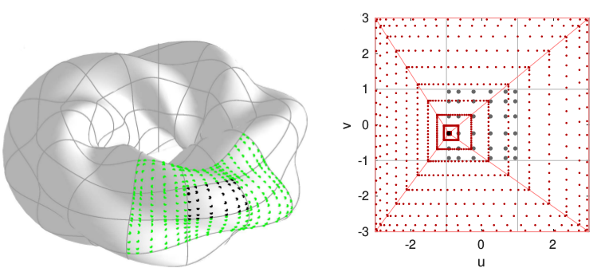

# BIE3D: MATLAB tools for boundary integral equations on surfaces in 3D

This is a preliminary set of high-order accurate global double periodic trapezoid rule and quad-panel based surface quadratures for kernels that have on-surface weak singularities no more singular than 1/r. It currently contains only a torus and its modulation via a general smooth radius function, with on-surface quadratures only for uniform arbitrary-order quad patches, with the Laplace (an elliptic BVP) and wave-equation (hyperbolic BVP) kernels.

Main author:  Alex Barnett

Contributions: Tom Hagstrom - f90 modules for interpolation from time grid.

Version: 20190821

### Dependencies

MATLAB. Codes have not been tested on MATLAB versions prior to R2012a.

For `timedomainwaveeqn`:

* Fortran compiler to build Hagstrom time interpolation and MEX interface.  
* Optionally: `fsparse` from [stenglib](https://github.com/stefanengblom/stenglib), compiled with `make('openmp',true)`, for fast multithreaded sparse matrix assembly.  

### Installation

Download using `git`, `svn`, or as a zip (see green button above).

Open MATLAB in the top level (`BIE3D`) directory, and run `bie3dsetup` to add all needed directories to your path. 

Test by running `testall` which currently tests Laplace quadratures on a torus, and should produce lots of error outputs close to machine precision, convergent sequences of numbers, and some plots, and yet not crash.

### Directories

`kernels`  : Laplace evaluation, including on-surface (self-eval)  
`surfaces` : smooth surface generators  
`singquad` : special surface quadratures for weakly singular kernels  
`utils`    : general numerical and plot utilities  
`test`     : test codes (other than built-in self-tests)  
`timedomainwaveeqn` : time-domain integral-equations for acoustics codes (see [movie](http://users.flatironinstitute.org/~ahb/images/cruller_scatt_plane_pulse_m4_p6_np24_hi.mp4))  
`doublyperiodic` : an old self-contained code for doubly-periodic Laplace dipoles in 3D  
