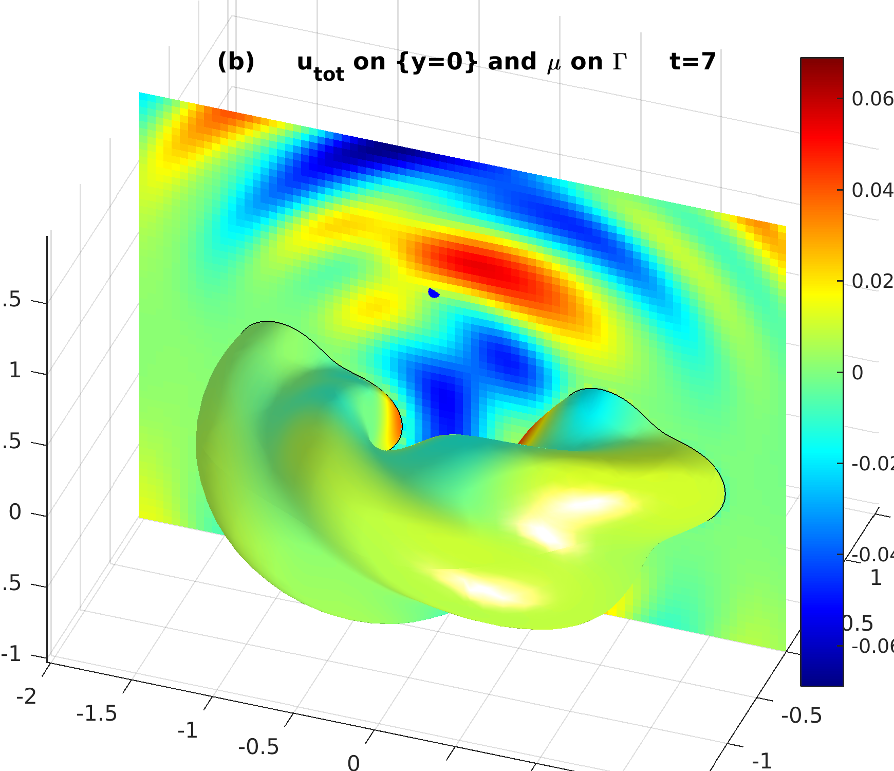

# Time-domain integral-equation solver for 3D acoustic wave equation

This directory contains the implementation of the scheme
proposed in:
A. H. Barnett, L. Greengard, T. Hagstrom,
"High-order discretization of a stable time-domain integral equation for 3D acoustic scattering," (2019).

See the ``paper`` directory for figure-generating codes.

See the ``timeinterp`` directory for Fortran90 codes for D-spline basis functions by Tom Hagstrom.

For the full movie, see [here](http://users.flatironinstitute.org/~ahb/images/cruller_scatt_plane_pulse_m4_p6_np24_hi.mp4)
